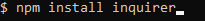
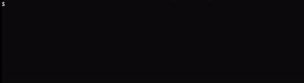
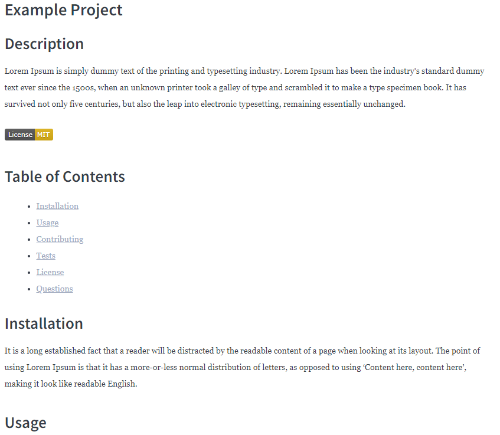

# Readme Generator

## Description
This application allows the user to follow a series of prompts that will then be formatted into a professional readme.

-This program solves the tediousness that is involved with creating the most elements of a readme.

## Table of Contents
- [Installation](#installation)
- [Usage](#usage)
- [License](#license)
- [Questions](#questions)

## Installation
This Application requires [Nodejs](https://nodejs.org/) to be installed.
 
 Once you have downloaded this repository to your local machine, navigate within the command line to the folder that contains "index.js". 
 Once there type in "npm install inquirer" to the install the required dependancy inquirer which allows for the user to input information to the command line. 
  
 Upon installing you should be greeted with a message saying "added 66 packages in "x" seconds" 

## Usage
Once you have finished the installation process you can start the program by typing "node index.js" from the command line.
  
To complete the series of prompts the user needs to type in the information for each section and hit enter to move onto the next prompt. 
  
The license section requires the use of the arrows keys to navigate the list. Use the up and down arrow keys and then enter to choose your license
  

The following image demonstrates an example user going through the prompts provided by this application

Once you have completed all the prompts you will see the message "Succsessfully created readme!".
  
You will then find a file called "generated-readme.md" within the same directory where you downloaded this repository. This is the file that was created from the user inputted information.

The following is an example readme that was created using this application which can also be found within the assets folder of this repository under assets/sameple-readme.md.

## License
This project is licensed under the MIT license.

## Questions
If you have any questions, please feel free to reach out to me at my GitHub: [drewhermanson](https://github.com/drewhermanson)
or by email: drew.hermanson@gmail.com